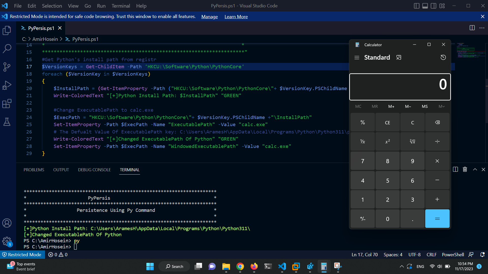

# PyPersis
this PowerShell script is designed to manipulate the Windows registry keys related to Python installations for the purpose of creating persistence and potentially executing arbitrary commands when Python commands or binaries are run.

  

this script Specifically, it iterates through the Python version keys in the Windows registry under the current user hive, retrieves the install path for each version, and then changes the "ExecutablePath" property to point to "calc.exe". This effectively sets it up so that when the user runs a Python command or binary, "calc.exe" or another specified binary would be executed instead.
### Caution:
- EventLogSilencer is intended for educational. Use responsibly and ensure compliance with applicable laws and regulations.
- Use in a controlled environment to prevent unintended impact on critical systems.

Disclaimer:
This script is provided as-is without any warranty. The author takes no responsibility for the misuse or consequences of its usage. It is recommended to review and understand the script's functionality before execution.
